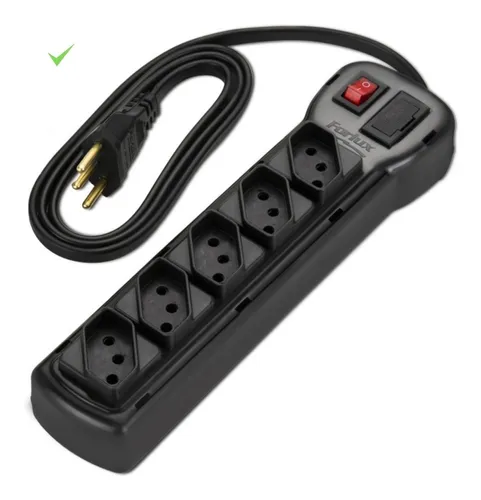

### Geral
Este é um projeto Open Source/Open Hardware com a intenção de retribuir um pouco com a comunidade por tudo o que eu já consumi de informação.

### Idéia para o Projeto.
Como noventa porcento dos projetos são feitos por conta de preguiça, eu possuia uma regua de energia e queria automatizar a Ligação ON/OFF dela. com isso eu possuia uma regua de energia igual ao da imagem

### Hardware
Itens Necessários para a montagem.

01 unidade - Caixa Régua de Tensão [Marca: Patola Modelo: PB-560/6](http://www.patola.com.br/index.php?route=product/product&product_id=66&search=PB+560%2F6)

### Software
